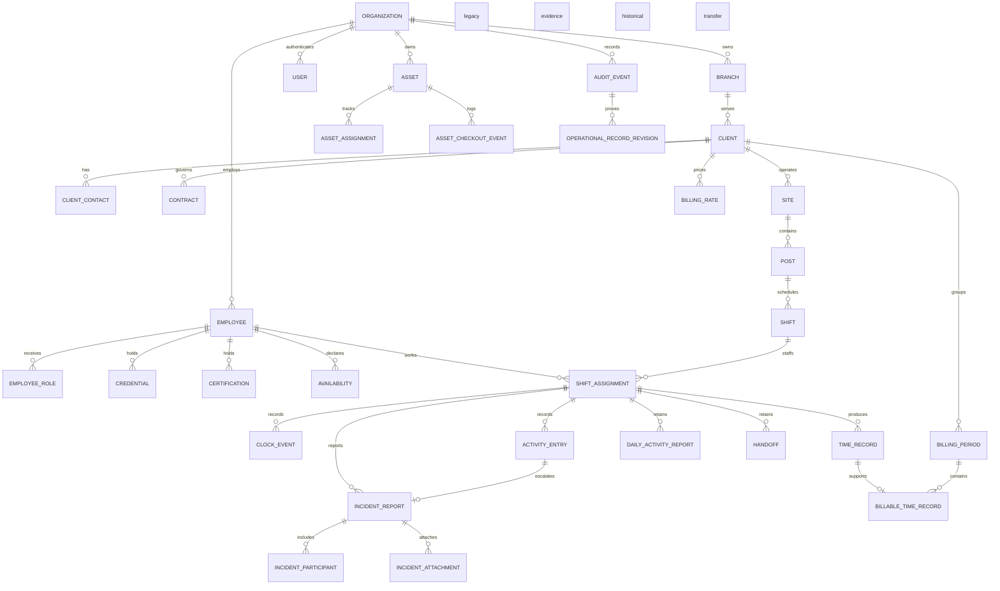

# Domain model

The canonical V1 model represents uniformed/static-site security operations. UUID primary keys are stable identifiers; relationships carry business ownership rather than duplicating derived facts.

The reporting authority, taxonomy, lifecycle, and legacy compatibility boundary is defined in [Reporting domain](reporting-domain.md). `OperationalRecordRevision` stores immutable snapshots for material post-submission changes. `BillableTimeRecord` is approved operational time at an applicable rate; it is not an accounting ledger.

Service types are extensible V1 static/uniformed categories. They contain no vehicle-patrol or Executive Protection behavior.

## Asset custody authority

`AssetCheckoutEvent` is the append-only authoritative custody history. Every checkout, check-in, employee transfer, and inventory-site relocation records the prior and resulting custodian/location, actor, reason, timestamp, and condition in the same database transaction that updates the asset's current projection.

`Asset.assignedEmployeeId` and `Asset.assignedSiteId` are the single current-custody projection. Inventory administration cannot write those fields; custody changes must use the custody transaction. The older `AssetAssignment` structure is retained only as non-authoritative legacy evidence and is not a writable source of current custody. A failed or stale custody transaction commits neither an event, projection change, nor audit entry.

### Missing assets and recovery

`missing` is an unresolved location discrepancy, not lost, retired, damaged, available, or checked in. An authorized `REPORT_MISSING` transaction requires a reason, preserves the last-known employee/site and condition, and appends an immutable event with actor/time and matching application audit evidence. These references describe last-known custody while the asset is missing, not confirmed physical location. Ordinary checkout, check-in, transfer, relocation, repeat missing reports, and inventory status changes cannot resolve or bypass this state.

`RECOVER` requires an authorized active receiving site, observed condition, reason, and expected version. It records prior custody, moves the projection to that site, and sets `maintenance` for inspection; it never silently marks the asset available. Subsequent activation uses existing audited inventory administration. Both transitions share the canonical asset row lock, version check, and atomic event/projection/audit transaction. Retired assets require explicit administrative review before being reported missing. Deactivation does not erase last-known custody. No `LOST` terminal disposition or investigation case-management workflow is introduced.

No migration is required: asset status and custody event type are existing text columns. Deploy the updated validation/readers and writers together. Rolling back to older writers after missing events exist is unsafe because their ordinary check-in path does not recognize the missing-state restriction; disable asset mutations before an application rollback and retain all events and projections.
